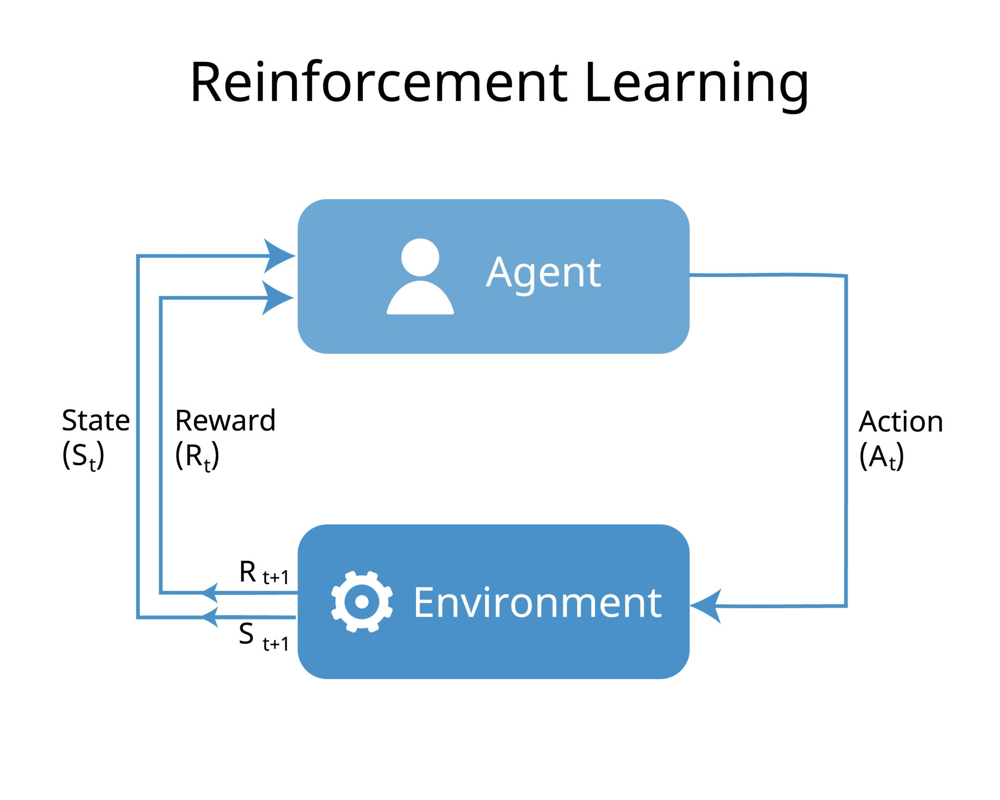
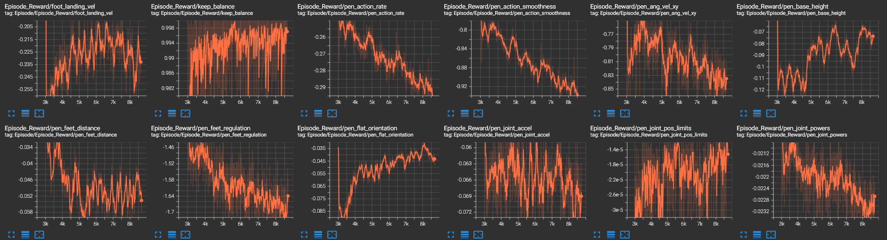
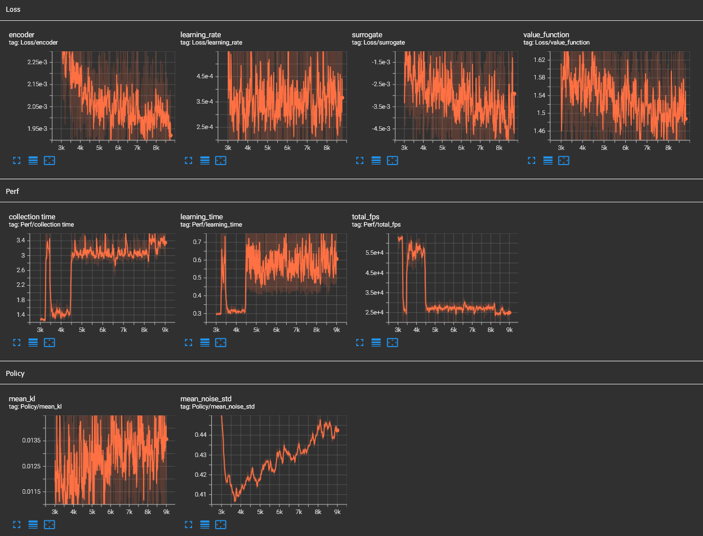
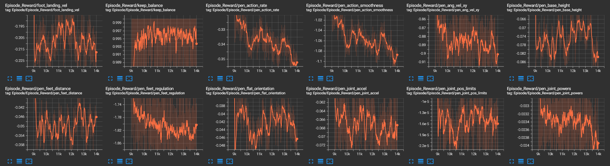
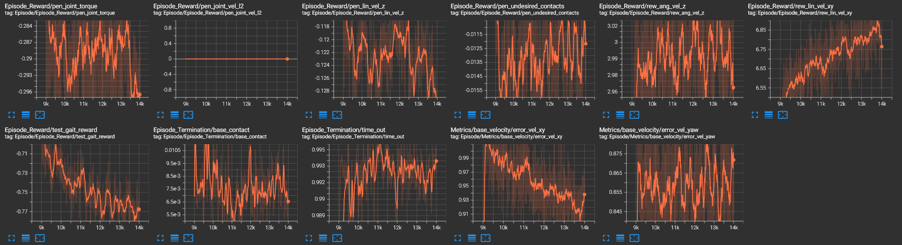
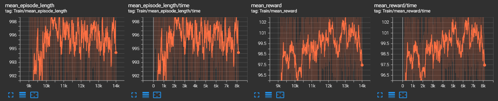
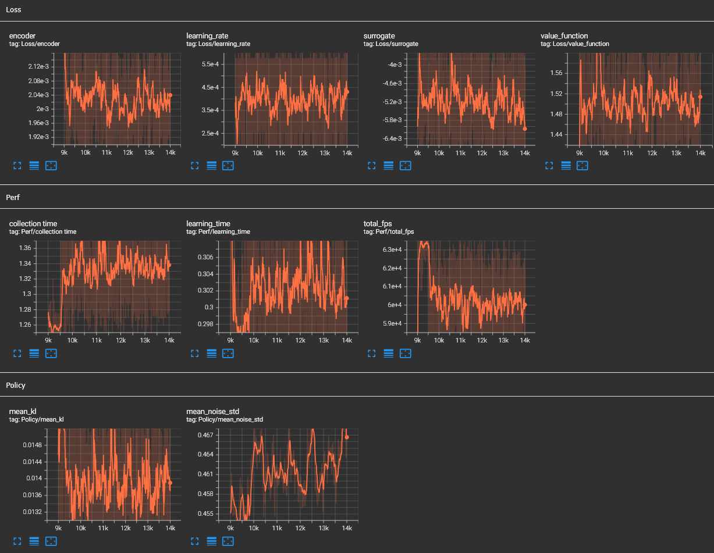
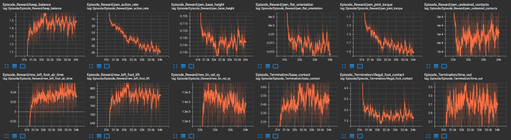
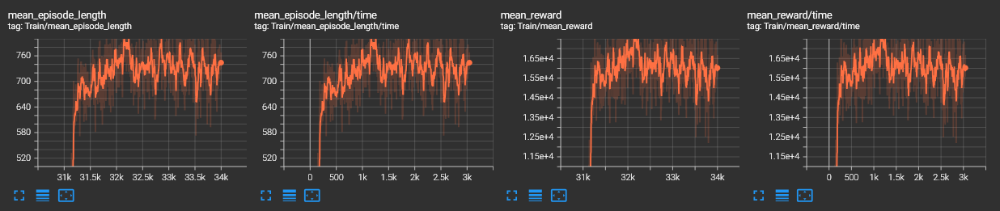
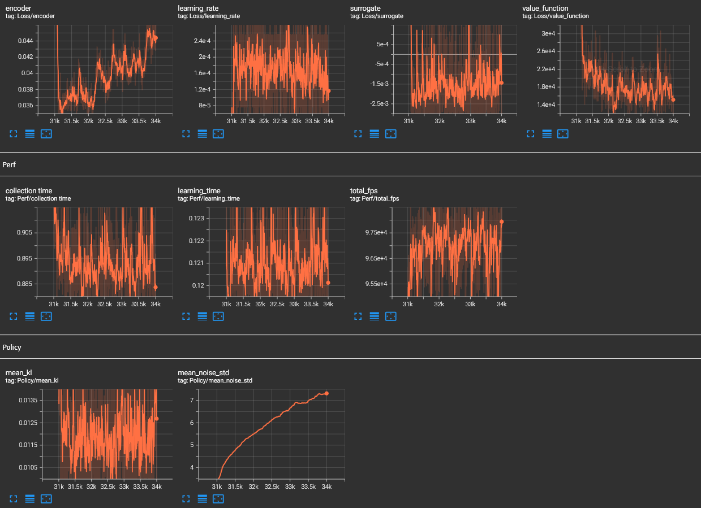

# 双足机器人强化学习运动控制项目 / Bipedal Robot RL Locomotion Learning Project

[](https://docs.omniverse.nvidia.com/isaacsim/latest/overview.html)
[](https://isaac-sim.github.io/IsaacLab)
[](https://docs.python.org/3/whatsnew/3.10.html)
[](https://releases.ubuntu.com/20.04/)
[](https://www.microsoft.com/en-us/)
[](https://pre-commit.com/)
[](https://opensource.org/license/mit)

## 概述 / Overview

该仓库用于训练和仿真双足机器人，例如[limxdynamics TRON1](https://www.limxdynamics.com/en/tron1)。借助[Isaac Lab](https://github.com/isaac-sim/IsaacLab)框架，我们可以训练双足机器人在不同环境中行走，包括平地、粗糙地形和楼梯等。

This repository is used to train and simulate bipedal robots, such as [limxdynamics TRON1](https://www.limxdynamics.com/en/tron1). With the help of [Isaac Lab](https://github.com/isaac-sim/IsaacLab), we can train the bipedal robots to walk in different environments, such as flat, rough, and stairs.

**关键词 / Keywords:** isaaclab, locomotion, bipedal, pointfoot, TRON1

---

## 🎯 主要内容

### 模块化强化学习架构
基于 Isaac Lab 的 Manager-Based RL 架构，我们实现了高度解耦的模块化设计：

<p align="center">
  
</p>
### 关键技术突破

#### 1. 平地速度跟随 (Flat Ground Velocity Tracking)

**解决方案：**
- **场景配置**：使用 PFSceneCfg，将地形生成器设置为无限延伸的平面
- **感知输入**：采用"盲视"策略，仅依赖本体感知
- **动作空间**：采用关节位置控制的残差模式，scale=0.25

**奖励函数设计：**
- **核心奖励**：使用高斯核函数 track_lin_vel_xy_exp
- **正则化惩罚**：pen_joint_torque、pen_action_rate、pen_lin_vel_z

**参数调整过程：**
- 初始参数：weight=1.0，std=0.25
- 优化参数：weight=1.5，std=0.5
- 结果：机器人能够快速响应摇杆命令，步态自然且能耗较低

**训练曲线：**
<p align="center">
  
</p>
<p align="center">
  
</p>


#### 2. 抗干扰鲁棒性测试与复杂地形适应

**解决方案：**
- 在平地环境基础上，引入域随机化中的"推力干扰"
- 启用 TerrainImporterCfg 并加载 MIXED_EXAM_TERRAINS_CFG

**奖励函数设计：**
- **核心惩罚**：pen_undesired_contacts，权重 -1.0
- **引导奖励**：rew_feet_air_time，鼓励抬腿跨越台阶
- **重心调整**：pen_base_height，降低重心以换取稳定性

**参数调整：**
- 观测空间：确保 Critic 网络输入包含地形高度图
- 课程学习：启用 terrain_levels，先从平地训练
- 权重微调：降低 pen_lin_vel_z 的权重

**训练曲线：**
<p align="center">
  
</p>

<p align="center">
  
</p>

<p align="center">
  
</p>

<p align="center">
  
</p>

#### 3. 特技动作：单脚跳 (One-Legged Balancing)

**解决方案：**
- 创建独立配置文件 stunt_one_leg_env_cfg.py
- 感知重构：移除对地形高度图的依赖
- 动作空间：沿用残差控制

**奖励函数设计：**
- **非对称触地惩罚**：pen_left_foot_contact，权重 -50.0
- **抬腿引导**：rew_feet_air_time / feet_regulation
- **动作平滑**：pen_action_rate 权重从 -0.005 提升至 -0.1

**参数调整：**
- 应对奖励机制漏洞利用现象
- 将触地惩罚权重从 -10 提升至 -50
- 设置触地即死规则
- 建立连续奖励和惩罚函数

**训练曲线：**
<p align="center">
  
</p>

<p align="center">
  
</p>

<p align="center">
  
</p>
---

## 🚀 快速开始

### 环境配置

**方法一：一键安装脚本（非官方，推荐）**
```bash
wget -O install_isaaclab.sh https://docs.robotsfan.com/install_isaaclab.sh && bash install_isaaclab.sh
```
感谢一键安装脚本作者[@fan-ziqi](https://github.com/fan-ziqi)。该仓库使用Isaacsim 2.1.0版本。

**方法二：官方安装**
按照 [Isaac Lab安装指南](https://isaac-sim.github.io/IsaacLab/v2.1.0/source/setup/installation/binaries_installation.html) 进行安装。

### 仓库克隆与依赖安装
```bash
# 克隆仓库
git clone https://github.com/nkdtiancaichen/limxtron1lab-main.git
cd limxtron1lab-main

# 激活环境
conda activate isaaclab

# 进入项目目录
cd bipedal_locomotion_isaaclab

# 安装库
python -m pip install -e exts/bipedal_locomotion

# 安装RSL-RL库
cd rsl_rl
python -m pip install -e .
```

## IDE设置（可选）/ Set up IDE (Optional)

要设置IDE，请按照以下说明操作：
To setup the IDE, please follow these instructions:

- 将.vscode/settings.json中的路径替换成使用者所使用的Isaaclab和python路径，这样当使用者对Isaaclab官方函数或变量进行检索的时候，可以直接跳入配置环境代码的定义。

- Replace the path in .vscode/settings.json with the Isaaclab and python paths used by the user. This way, when the user retrieves the official functions or variables of Isaaclab, they can directly jump into the definition of the configuration environment code.

### 训练双足机器人智能体
```bash
# 平地速度跟踪训练
python scripts/rsl_rl/train.py --task=Isaac-Limx-PF-Blind-Flat-v0 --headless

# 单脚跳特技训练
python scripts/rsl_rl/train.py --task=Isaac-Limx-PF-Stunt-OneLeg-v0
```

**训练参数：**
- `--headless`: 以无渲染模式运行仿真
- `--num_envs`: 并行环境数量
- `--max_iterations`: 最大训练迭代次数
- `--save_interval`: 保存模型间隔
- `--seed`: 随机种子

### 运行训练好的模型
```bash
# 走路+单脚跳展示：按k单脚跳，再按就变回走路
python scripts/rsl_rl/play.py --task=Isaac-Limx-PF-Stunt-OneLeg-v0 --num_envs=1 --checkpoint_path="model/walk_model.pt" --hop_checkpoint_path="model/one_leg_model.pt" --video --video_length=10000

# 多地形测试
python scripts/rsl_rl/play.py --task=Isaac-Limx-PF-Blind-Flat-v0 --num_envs=100 --checkpoint_path="model/walk_model.pt" --hop_checkpoint_path="model/one_leg_model.pt"
```

---
## 在Mujoco中运行导出模型（仿真到仿真）/ Running exported model in mujoco (sim2sim)

- 运行模型后，策略已经保存。您可以将策略导出到mujoco环境，并参照在github开源的部署工程[tron1-rl-deploy-python](https://github.com/limxdynamics/tron1-rl-deploy-python)在[pointfoot-mujoco-sim](https://github.com/limxdynamics/pointfoot-mujoco-sim)中运行。

  After playing the model, the policy has already been saved. You can export the policy to mujoco environment and run it in mujoco [pointfoot-mujoco-sim]((https://github.com/limxdynamics/pointfoot-mujoco-sim)) by using the [tron1-rl-deploy-python]((https://github.com/limxdynamics/tron1-rl-deploy-python)).

- 按照说明正确安装，并用您训练的`policy.onnx`和`encoder.onnx`替换原始文件。

  Following the instructions to install it properly and replace the origin policy by your trained `policy.onnx` and `encoder.onnx`.

## 在真实机器人上运行导出模型（仿真到现实）/ Running exported model in real robot (sim2real)
<p align="center">
    
</p>

**学习框架概述 / Overview of the learning framework.**

- 策略使用PPO在异步actor-critic框架内进行训练，动作由历史观察信息编码器和本体感受确定。**灵感来自论文CTS: Concurrent Teacher-Student Reinforcement Learning for Legged Locomotion. ([H. Wang, H. Luo, W. Zhang, and H. Chen (2024)](https://doi.org/10.1109/LRA.2024.3457379))**

  The policies are trained using PPO within an asymmetric actor-critic framework, with actions determined by history observations latent and proprioceptive observation. **Inspired by the paper CTS: Concurrent Teacher-Student Reinforcement Learning for Legged Locomotion. ([H. Wang, H. Luo, W. Zhang, and H. Chen (2024)](https://doi.org/10.1109/LRA.2024.3457379))**

- 实机部署详情见 https://support.limxdynamics.com/docs/tron-1-sdk/rl-training-results-deployment 8.1~8.2章节

  Real deployment details see section https://support.limxdynamics.com/docs/tron-1-sdk/rl-training-results-deployment 8.1 ~ 8.2

---

## 🎥 演示视频

### Isaac Lab仿真
<p align="center">
  
</p>

### Mujoco中的仿真 / Simulation in Mujoco
- **点足盲目平地 / Pointfoot Blind Flat**:


### 成果展示
<p align="center">
  
</p>

### 真实机器人部署
<p align="center">
  
</p>

---

## 🙏 致谢

本项目基于以下开源项目构建：
- **[IsaacLab](https://github.com/isaac-sim/IsaacLab)** - NVIDIA Isaac Lab仿真框架
- **[rsl_rl](https://github.com/leggedrobotics/rsl_rl)** - 高效RL算法库
- **[limxdynamics](https://github.com/limxdynamics)** - TRON1机器人硬件与SDK
- **[bipedal_locomotion_isaaclab](https://github.com/Andy-xiong6/bipedal_locomotion_isaaclab)** - 双足运动基础框架

**特别感谢：**
- **[@fan-ziqi](https://github.com/fan-ziqi)** - 提供Isaac Lab一键安装脚本
- **项目导师** - 提供学术指导
- **所有项目人员** - 协助模型验证与改进

**项目成员：** 林江、陈东杰

## 📄 许可证

本项目基于 [MIT License](LICENCE) 开源。


<p align="center">
  <em>探索机器人运动的无限可能</em>
</p>
